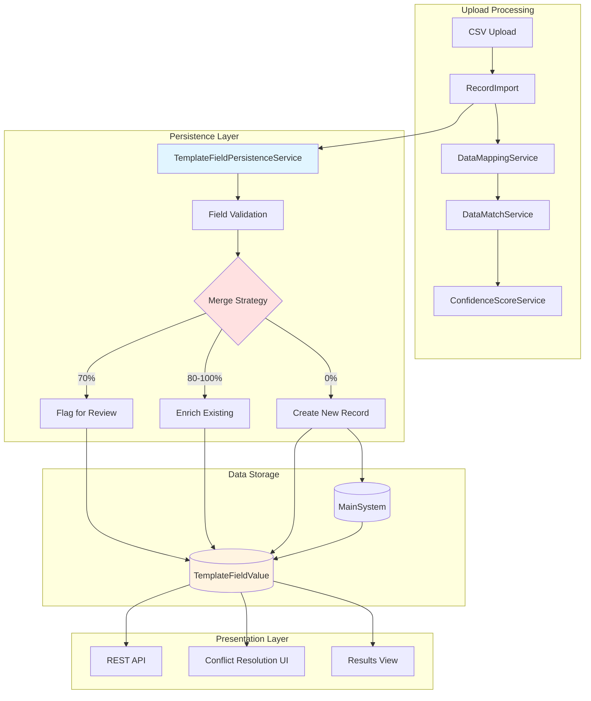
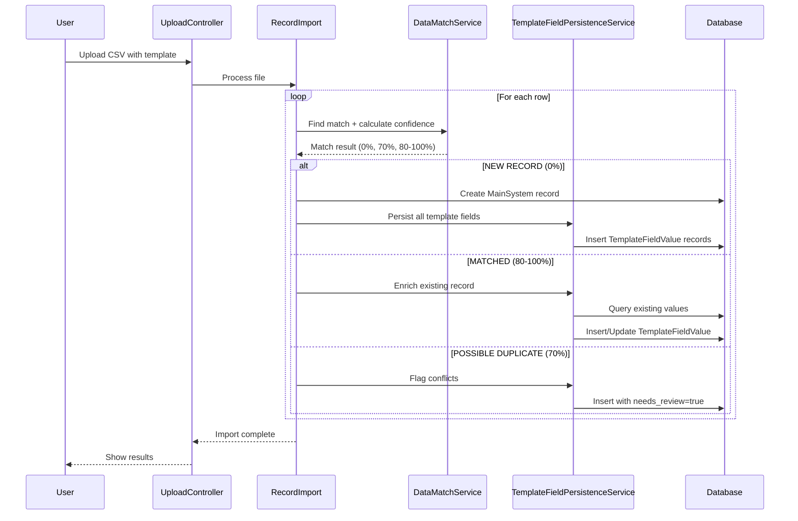
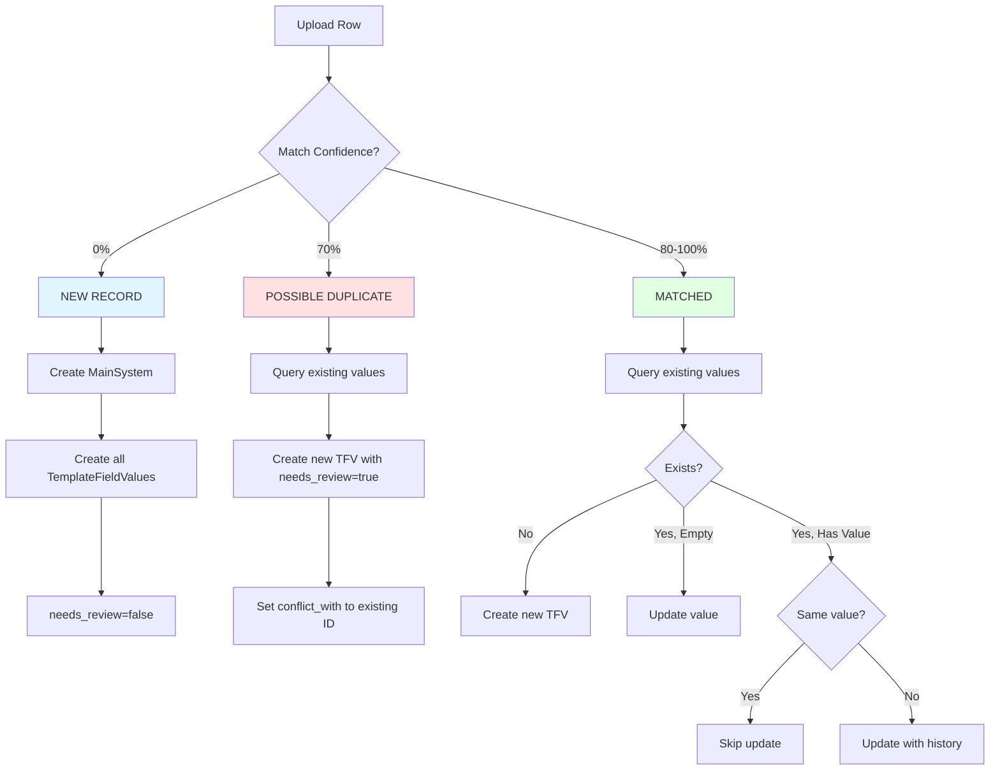

# Design Document: Template Field Persistence

## Overview

This feature implements persistent storage for template field values using an Entity-Attribute-Value (EAV) style approach. Currently, template field values exist only temporarily in the `match_results.field_breakdown` JSON column and are lost after viewing results. This design enables progressive data enrichment where each upload adds or updates template data on MainSystem records.

The system implements intelligent merge strategies based on match confidence levels:
- **NEW RECORD (0%)**: Create new MainSystem record and store all template field values
- **MATCHED (100%, 90%, 80%)**: Enrich existing record by adding new fields, updating empty fields, and preserving history
- **POSSIBLE DUPLICATE (70%)**: Store values with `needs_review=true` flag for manual conflict resolution

### Key Benefits

- **Progressive Enrichment**: Data accumulates across multiple uploads, building complete records over time
- **Audit Trail**: Track which batch added or modified each field value
- **Conflict Resolution**: Manual review process for ambiguous matches
- **History Tracking**: Preserve previous values when updating fields
- **Type Safety**: Validate values against TemplateField definitions before storage

### Design Principles

- Leverage existing template infrastructure (TemplateField, ColumnMappingTemplate)
- Maintain backward compatibility with existing field_breakdown JSON
- Use database transactions for atomicity
- Optimize for bulk operations during large uploads
- Provide clear separation between core fields (MainSystem) and template fields (TemplateFieldValue)

## Architecture

### High-Level Component Diagram



### Data Flow Sequence



## Components and Interfaces

### 1. TemplateFieldValue Model

**Responsibility**: Eloquent model representing persistent template field values

**Location**: `app/Models/TemplateFieldValue.php`

**Properties**:
```php
protected $fillable = [
    'main_system_id',
    'template_field_id',
    'value',
    'previous_value',
    'batch_id',
    'needs_review',
    'conflict_with',
];

protected $casts = [
    'needs_review' => 'boolean',
    'created_at' => 'datetime',
    'updated_at' => 'datetime',
];
```

**Relationships**:
```php
public function mainSystem(): BelongsTo
public function templateField(): BelongsTo
public function batch(): BelongsTo
public function conflictingValue(): BelongsTo  // Self-referencing
```

**Methods**:
```php
public function hasConflict(): bool
public function getHistory(): array
public function resolveConflict(string $resolution, ?string $customValue = null): void
```

### 2. Enhanced MainSystem Model

**New Relationships**:
```php
public function templateFieldValues(): HasMany
```

**New Methods**:
```php
public function getTemplateFieldValue(string $fieldName): ?string
public function getAllTemplateFields(): array
public function hasTemplateField(string $fieldName): bool
public function getTemplateFieldsNeedingReview(): Collection
```

### 3. TemplateFieldPersistenceService

**Responsibility**: Centralized service for persisting template field values with merge strategies

**Location**: `app/Services/TemplateFieldPersistenceService.php`

**Public Interface**:
```php
public function persistTemplateFields(
    int $mainSystemId,
    array $templateFields,
    int $batchId,
    int $matchConfidence,
    ?int $templateId = null
): array

public function resolveConflict(
    int $templateFieldValueId,
    string $resolution,
    ?string $customValue = null
): void

public function bulkPersist(array $records): array
```

**Private Methods**:
```php
private function handleNewRecord(int $mainSystemId, array $fields, int $batchId): array
private function handleMatchedRecord(int $mainSystemId, array $fields, int $batchId): array
private function handlePossibleDuplicate(int $mainSystemId, array $fields, int $batchId): array
private function validateFieldValue(TemplateField $field, $value): array
private function getExistingValues(int $mainSystemId, array $fieldIds): Collection
```

### 4. Enhanced RecordImport

**New Responsibilities**:
- Extract template field values from mapped data
- Call TemplateFieldPersistenceService after MainSystem record is saved
- Handle persistence errors gracefully

**Modified Methods**:
```php
public function collection(Collection $rows)
{
    // Existing logic...
    
    // NEW: After MainSystem record is saved
    if (!empty($mappedData['template_fields'])) {
        try {
            $this->persistenceService->persistTemplateFields(
                $mainSystemId,
                $mappedData['template_fields'],
                $this->batchId,
                $matchResult['confidence'],
                $this->template?->id
            );
        } catch (\Exception $e) {
            Log::error('Template field persistence failed', [
                'row' => $index,
                'error' => $e->getMessage()
            ]);
        }
    }
}
```

### 5. Enhanced DataMappingService

**Modified Return Structure**:
```php
public function mapUploadedData(array $row): array
{
    return [
        'core_fields' => [...],      // Existing
        'template_fields' => [...]   // NEW: Non-core fields from template
    ];
}
```

### 6. Results View Enhancements

**New Components**:
- Template field value display in results table
- Batch provenance indicators
- Conflict warning badges
- History modal for field changes

**Template Structure**:
```blade
@foreach($result->matchedRecord->templateFieldValues as $tfv)
    <div class="template-field">
        <span class="field-name">{{ $tfv->templateField->field_name }}</span>
        <span class="field-value">{{ $tfv->value }}</span>
        
        @if($tfv->needs_review)
            <span class="badge badge-warning">Needs Review</span>
        @endif
        
        @if($tfv->previous_value)
            <button class="btn-history" data-field-id="{{ $tfv->id }}">
                View History
            </button>
        @endif
        
        <span class="batch-info">Added by Batch #{{ $tfv->batch_id }}</span>
    </div>
@endforeach
```

### 7. Conflict Resolution UI

**Location**: `resources/views/pages/conflicts.blade.php`

**Features**:
- List all TemplateFieldValue records where `needs_review=true`
- Side-by-side comparison of existing vs new values
- Resolution options: Keep Existing, Use New, Edit Manually
- Bulk resolution capabilities
- Filtering by batch, field name, or MainSystem record

**Controller**: `app/Http/Controllers/ConflictResolutionController.php`

**Routes**:
```php
Route::get('/conflicts', [ConflictResolutionController::class, 'index']);
Route::post('/conflicts/{id}/resolve', [ConflictResolutionController::class, 'resolve']);
Route::post('/conflicts/bulk-resolve', [ConflictResolutionController::class, 'bulkResolve']);
```

### 8. API Endpoints

**Controller**: `app/Http/Controllers/Api/TemplateFieldValueController.php`

**Endpoints**:
```php
GET    /api/main-system/{id}/template-fields
GET    /api/template-field-values/{id}
PUT    /api/template-field-values/{id}
GET    /api/batches/{id}/template-field-values
GET    /api/template-field-values/conflicts
POST   /api/template-field-values/{id}/resolve
```

**Response Format**:
```json
{
    "id": 123,
    "main_system_id": 456,
    "template_field": {
        "id": 789,
        "field_name": "employee_id",
        "field_type": "string"
    },
    "value": "EMP-12345",
    "previous_value": "EMP-12344",
    "batch_id": 10,
    "needs_review": false,
    "conflict_with": null,
    "created_at": "2024-01-15T10:30:00Z",
    "updated_at": "2024-01-20T14:45:00Z"
}
```

## Data Models

### Database Schema

```mermaid
erDiagram
    main_system ||--o{ template_field_values : "has many"
    template_fields ||--o{ template_field_values : "defines"
    upload_batches ||--o{ template_field_values : "tracks"
    template_field_values ||--o| template_field_values : "conflicts with"
    
    main_system {
        bigint id PK
        string uid
        bigint origin_batch_id FK
        string last_name
        string first_name
        string middle_name
        date birthday
        string gender
        string address
        string barangay
        timestamps
    }
    
    template_fields {
        bigint id PK
        bigint template_id FK
        string field_name
        string field_type
        boolean is_required
        timestamps
    }
    
    template_field_values {
        bigint id PK
        bigint main_system_id FK
        bigint template_field_id FK
        text value
        text previous_value
        bigint batch_id FK
        boolean needs_review
        bigint conflict_with FK
        timestamps
    }
    
    upload_batches {
        bigint id PK
        string filename
        string status
        timestamps
    }
```

### Migration: Create template_field_values Table

**File**: `database/migrations/YYYY_MM_DD_HHMMSS_create_template_field_values_table.php`

```php
public function up(): void
{
    Schema::create('template_field_values', function (Blueprint $table) {
        $table->id();
        $table->foreignId('main_system_id')
            ->constrained('main_system')
            ->onDelete('cascade');
        $table->foreignId('template_field_id')
            ->constrained('template_fields')
            ->onDelete('cascade');
        $table->text('value');
        $table->text('previous_value')->nullable();
        $table->foreignId('batch_id')
            ->nullable()
            ->constrained('upload_batches')
            ->onDelete('set null');
        $table->boolean('needs_review')->default(false);
        $table->foreignId('conflict_with')
            ->nullable()
            ->constrained('template_field_values')
            ->onDelete('set null');
        $table->timestamps();
        
        // Unique constraint: one value per field per record
        $table->unique(['main_system_id', 'template_field_id']);
        
        // Indexes for performance
        $table->index('main_system_id');
        $table->index('template_field_id');
        $table->index('batch_id');
        $table->index('needs_review');
    });
}

public function down(): void
{
    Schema::dropIfExists('template_field_values');
}
```

### Field Descriptions

**template_field_values table**:

- `id`: Primary key
- `main_system_id`: Foreign key to main_system.id (CASCADE on delete)
- `template_field_id`: Foreign key to template_fields.id (CASCADE on delete)
- `value`: The actual field value (TEXT to support long strings)
- `previous_value`: Previous value for history tracking (NULL for first insert)
- `batch_id`: Foreign key to upload_batches.id (SET NULL on delete for audit trail)
- `needs_review`: Boolean flag for conflict resolution (default false)
- `conflict_with`: Self-referencing FK to another template_field_value record (for 70% matches)
- `created_at`: Timestamp when value was first created
- `updated_at`: Timestamp when value was last modified

**Constraints**:
- UNIQUE(main_system_id, template_field_id): Prevents duplicate values for same field on same record
- All foreign keys have appropriate ON DELETE actions

## Merge Strategies

### Strategy 1: NEW RECORD (0% Confidence)

**Trigger**: Match confidence is 0%

**Behavior**:
1. Create new MainSystem record with core fields
2. For each non-empty template field:
   - Create TemplateFieldValue record
   - Set `value` to uploaded value
   - Set `previous_value` to NULL
   - Set `batch_id` to current batch
   - Set `needs_review` to false
   - Set `conflict_with` to NULL
3. Validate each value against TemplateField definition
4. Skip invalid values with warning log

**Example**:
```php
// Upload: employee_id=EMP-001, department=Sales
// Result: 2 new TemplateFieldValue records created
```

### Strategy 2: MATCHED RECORD (100%, 90%, 80% Confidence)

**Trigger**: Match confidence is 80% or higher

**Behavior**: Enrich and Preserve

For each template field in upload:
1. Query existing TemplateFieldValue for (main_system_id, template_field_id)
2. If no existing record:
   - Create new TemplateFieldValue
   - Set `value` to uploaded value
   - Set `previous_value` to NULL
   - Set `needs_review` to false
3. If existing record with NULL or empty value:
   - Update `value` to uploaded value
   - Keep `previous_value` as NULL
   - Update `batch_id` to current batch
   - Set `needs_review` to false
4. If existing record with non-empty value:
   - Compare values
   - If identical, skip update
   - If different:
     - Set `previous_value` to current `value`
     - Set `value` to uploaded value
     - Update `batch_id` to current batch
     - Set `needs_review` to false
5. Update `updated_at` timestamp

**Example**:
```php
// Existing: employee_id=EMP-001, department=NULL
// Upload: employee_id=EMP-001, department=Sales, position=Manager
// Result:
//   - employee_id: No change (identical)
//   - department: Updated from NULL to "Sales"
//   - position: New field created with value "Manager"
```

### Strategy 3: POSSIBLE DUPLICATE (70% Confidence)

**Trigger**: Match confidence is exactly 70%

**Behavior**: Flag for Manual Review

For each template field in upload:
1. Query existing TemplateFieldValue for (main_system_id, template_field_id)
2. If no existing record:
   - Create new TemplateFieldValue
   - Set `value` to uploaded value
   - Set `needs_review` to true
   - Set `conflict_with` to NULL
3. If existing record exists:
   - Create NEW TemplateFieldValue record (not update)
   - Set `value` to uploaded value
   - Set `needs_review` to true
   - Set `conflict_with` to existing record's ID
   - Set `batch_id` to current batch
4. Do NOT modify existing TemplateFieldValue record
5. User must manually resolve conflict later

**Example**:
```php
// Existing: employee_id=EMP-001 (record A)
// Upload: employee_id=EMP-002 (70% match to record A)
// Result:
//   - Original TemplateFieldValue unchanged
//   - New TemplateFieldValue created with needs_review=true, conflict_with=original_id
//   - Admin must choose: Keep EMP-001, Use EMP-002, or Edit manually
```

### Merge Strategy Decision Tree




## Correctness Properties

*A property is a characteristic or behavior that should hold true across all valid executions of a system—essentially, a formal statement about what the system should do. Properties serve as the bridge between human-readable specifications and machine-verifiable correctness guarantees.*

### Property Reflection

After analyzing all acceptance criteria, I identified the following redundancies:
- Requirements 1.2, 1.3, 1.4 test cascade/set null behavior - these can be combined into a single foreign key constraint property
- Requirements 4.3, 4.4, 4.5 all test initial state of NEW RECORD template field values - can be combined
- Requirements 5.5, 5.6 both test update behavior for MATCHED records - can be combined
- Requirements 7.4-7.7 are covered by other properties (4.x, 5.x, 6.x)
- Requirements 14.1-14.5 duplicate earlier constraint testing (1.2-1.5)
- Requirement 15.2 duplicates 15.1

The following properties represent unique, non-redundant validation requirements:

### Property 1: Foreign Key Cascade Behavior

*For any* MainSystem record with associated TemplateFieldValue records, when the MainSystem record is deleted, all associated TemplateFieldValue records should also be deleted (CASCADE). Similarly, when a TemplateField is deleted, all TemplateFieldValue records referencing it should be deleted. When an UploadBatch is deleted, associated TemplateFieldValue records should have their batch_id set to NULL (SET NULL).

**Validates: Requirements 1.2, 1.3, 1.4**

### Property 2: Unique Constraint Enforcement

*For any* MainSystem record and TemplateField combination, attempting to create a second TemplateFieldValue record with the same (main_system_id, template_field_id) pair should fail with a constraint violation.

**Validates: Requirements 1.5**

### Property 3: Migration Reversibility

*For any* database state, running the migration up() followed by down() should return the database to its original state (no template_field_values table exists).

**Validates: Requirements 1.10**

### Property 4: Model Relationship Integrity

*For any* TemplateFieldValue record, calling the mainSystem(), templateField(), batch(), and conflictingValue() relationship methods should return the correct related model instances or null.

**Validates: Requirements 2.2, 2.3, 2.4, 2.5**

### Property 5: Type Casting Correctness

*For any* TemplateFieldValue record, the needs_review attribute should be cast to boolean, and created_at/updated_at should be cast to datetime instances.

**Validates: Requirements 2.6, 2.7**

### Property 6: Conflict Detection

*For any* TemplateFieldValue record, hasConflict() should return true if and only if conflict_with is not null.

**Validates: Requirements 2.8**

### Property 7: History Retrieval

*For any* TemplateFieldValue record with a non-null previous_value, getHistory() should return an array containing both the current value and previous value.

**Validates: Requirements 2.9**

### Property 8: MainSystem Template Field Access

*For any* MainSystem record and field name, getTemplateFieldValue($fieldName) should return the value if a TemplateFieldValue exists for that field name, otherwise null. Similarly, hasTemplateField($fieldName) should return true if the field exists, false otherwise.

**Validates: Requirements 3.2, 3.4**

### Property 9: MainSystem All Template Fields Retrieval

*For any* MainSystem record, getAllTemplateFields() should return an associative array where keys are field names and values are the corresponding field values from all associated TemplateFieldValue records.

**Validates: Requirements 3.3**

### Property 10: MainSystem Conflict Filtering

*For any* MainSystem record, getTemplateFieldsNeedingReview() should return only those TemplateFieldValue records where needs_review is true.

**Validates: Requirements 3.5**

### Property 11: NEW RECORD Creates MainSystem and Template Values

*For any* upload data with 0% match confidence and non-empty template fields, the system should create a new MainSystem record and create TemplateFieldValue records for all non-empty template fields with needs_review=false, previous_value=null, and batch_id set to the current batch.

**Validates: Requirements 4.1, 4.2, 4.3, 4.4, 4.5**

### Property 12: Template Field Type Validation

*For any* template field value and its corresponding TemplateField definition, if the value does not match the field's data type (string, integer, decimal, date, boolean), the validation should fail and the value should not be persisted.

**Validates: Requirements 4.6, 4.7**

### Property 13: MATCHED Record Does Not Create New MainSystem

*For any* upload data with match confidence of 80%, 90%, or 100%, the system should not create a new MainSystem record.

**Validates: Requirements 5.1**

### Property 14: MATCHED Record Creates New Template Field Values

*For any* matched MainSystem record and template field that does not have an existing TemplateFieldValue, the system should create a new TemplateFieldValue record with the uploaded value.

**Validates: Requirements 5.2**

### Property 15: MATCHED Record Updates Empty Values

*For any* matched MainSystem record with an existing TemplateFieldValue that has a NULL or empty value, updating with a new value should set the value and keep previous_value as NULL.

**Validates: Requirements 5.3**

### Property 16: MATCHED Record Preserves History

*For any* matched MainSystem record with an existing TemplateFieldValue that has a non-empty value, updating with a different value should move the old value to previous_value and set the new value, along with updating batch_id and setting needs_review to false.

**Validates: Requirements 5.4, 5.5, 5.6**

### Property 17: MATCHED Record Updates Timestamp

*For any* TemplateFieldValue record that is modified, the updated_at timestamp should be more recent than the created_at timestamp.

**Validates: Requirements 5.7**

### Property 18: MATCHED Record Idempotence

*For any* matched MainSystem record where the uploaded template field value is identical to the existing value, no update should occur (the record should remain unchanged).

**Validates: Requirements 5.8**

### Property 19: POSSIBLE DUPLICATE Does Not Create New MainSystem

*For any* upload data with match confidence of exactly 70%, the system should not create a new MainSystem record.

**Validates: Requirements 6.1**

### Property 20: POSSIBLE DUPLICATE Flags for Review

*For any* possible duplicate match with template field values, the system should create TemplateFieldValue records with needs_review set to true and batch_id set to the current batch.

**Validates: Requirements 6.2, 6.4**

### Property 21: POSSIBLE DUPLICATE Links Conflicts

*For any* possible duplicate match where an existing TemplateFieldValue already exists for a field, the new TemplateFieldValue record should have conflict_with set to the existing record's ID, and the existing record should remain unchanged.

**Validates: Requirements 6.3, 6.5, 6.6**

### Property 22: Conflict Resolution Updates State

*For any* TemplateFieldValue record with needs_review=true, when a conflict is resolved, needs_review should be set to false and the chosen value should be applied.

**Validates: Requirements 6.7**

### Property 23: Persistence Service Transaction Atomicity

*For any* persistence operation that encounters an error mid-operation, all changes should be rolled back (no partial updates should persist).

**Validates: Requirements 7.8**

### Property 24: Persistence Service Audit Logging

*For any* persistence operation (create, update, conflict), a log entry should be created containing the operation details.

**Validates: Requirements 7.9**

### Property 25: Persistence Service Return Summary

*For any* persistence operation, the return value should contain counts of created, updated, and conflicted fields.

**Validates: Requirements 7.10**

### Property 26: RecordImport Extracts Template Fields

*For any* row with template fields, RecordImport should extract template field values into a template_fields array in the mapped data structure.

**Validates: Requirements 8.1**

### Property 27: RecordImport Calls Persistence Service

*For any* row processed by RecordImport that has template fields, the TemplateFieldPersistenceService should be called with main_system_id, template fields, batch_id, and match confidence.

**Validates: Requirements 8.2, 8.3**

### Property 28: RecordImport Error Handling

*For any* persistence error during import, the import should continue processing remaining rows and log the error with row number information.

**Validates: Requirements 8.4, 8.5**

### Property 29: RecordImport Backward Compatibility

*For any* upload without a template, RecordImport should process core MainSystem fields correctly without errors.

**Validates: Requirements 8.6, 15.4**

### Property 30: RecordImport Persistence Ordering

*For any* upload row, template field persistence should only occur after the MainSystem record has been saved to the database.

**Validates: Requirements 8.7**

### Property 31: DataMatchService Includes Template Fields

*For any* match result, the result structure should include template field data in both the match result and field_breakdown.

**Validates: Requirements 9.1, 9.2, 9.3**

### Property 32: DataMatchService Preserves Template Field Values

*For any* template field value during the matching process, the value should remain unchanged (matching does not modify values).

**Validates: Requirements 9.4, 9.5**

### Property 33: Batch Audit Trail

*For any* TemplateFieldValue record, the batch_id should reflect the batch that created or last modified the value, and querying by batch_id should return all values associated with that batch.

**Validates: Requirements 12.1, 12.2, 12.3**

### Property 34: Audit Timeline Retrieval

*For any* MainSystem record, the system should be able to retrieve a chronological timeline of all template field value changes.

**Validates: Requirements 12.6**

### Property 35: Bulk Insert Performance

*For any* batch of multiple TemplateFieldValue records being created, the system should use bulk insert operations rather than individual inserts.

**Validates: Requirements 13.1**

### Property 36: Large Batch Performance

*For any* batch with 1000 or more records, template field persistence should complete within 10 seconds.

**Validates: Requirements 13.4**

### Property 37: Template Field Definition Caching

*For any* batch processing operation, TemplateField definitions should be queried once and cached for reuse rather than queried repeatedly for each record.

**Validates: Requirements 13.6**

### Property 38: Template Field Belongs to Upload Template

*For any* template field value being persisted, the template_field_id should belong to the same template that was used for the upload.

**Validates: Requirements 14.6**

### Property 39: Constraint Violation Error Messages

*For any* database constraint violation (unique, foreign key, etc.), the system should return a meaningful error message rather than exposing raw database errors.

**Validates: Requirements 14.7**

### Property 40: Backward Compatibility with field_breakdown

*For any* match result, the field_breakdown JSON structure should continue to be populated with template field data for backward compatibility.

**Validates: Requirements 15.1**

### Property 41: Legacy Batch Support

*For any* batch uploaded before template field persistence was implemented, the results should still be viewable without errors.

**Validates: Requirements 15.3**

### Property 42: Empty Table Handling

*For any* query operation when the template_field_values table is empty, the system should handle it gracefully without errors.

**Validates: Requirements 15.5**

## Error Handling

### Validation Errors

**Type Mismatch**:
- Scenario: Uploaded value doesn't match TemplateField data type
- Handling: Log warning with field name, expected type, and actual value; skip field; continue processing
- User Feedback: Include validation errors in import summary

**Required Field Missing**:
- Scenario: TemplateField has is_required=true but value is empty
- Handling: Log error; mark row as failed; include in error report
- User Feedback: Show which rows failed and which required fields were missing

### Database Errors

**Constraint Violations**:
- Scenario: Unique constraint violation on (main_system_id, template_field_id)
- Handling: Catch exception; log error; return meaningful message
- User Feedback: "Duplicate field value detected for record X, field Y"

**Foreign Key Violations**:
- Scenario: Referenced MainSystem or TemplateField doesn't exist
- Handling: Catch exception; log error with IDs; rollback transaction
- User Feedback: "Invalid reference: record or field definition not found"

**Transaction Failures**:
- Scenario: Database error during bulk insert/update
- Handling: Rollback entire transaction; log full error; preserve data integrity
- User Feedback: "Persistence failed for batch X. No changes were saved."

### Service Errors

**Persistence Service Failures**:
- Scenario: TemplateFieldPersistenceService throws exception
- Handling: Catch in RecordImport; log error with row number; continue processing other rows
- User Feedback: Include failed rows in import summary with error messages

**Template Not Found**:
- Scenario: Template ID provided but template doesn't exist
- Handling: Throw exception before processing; prevent import
- User Feedback: "Template not found. Please select a valid template."

**Template Field Mismatch**:
- Scenario: Uploaded file has fields not in template definition
- Handling: Validate before import; reject file
- User Feedback: "File columns don't match template. Expected: [list], Found: [list]"

### Conflict Resolution Errors

**Invalid Resolution Action**:
- Scenario: User provides invalid resolution option
- Handling: Validate input; return 400 Bad Request
- User Feedback: "Invalid resolution action. Must be: keep_existing, use_new, or edit_manually"

**Conflict Already Resolved**:
- Scenario: User attempts to resolve already-resolved conflict
- Handling: Check needs_review flag; return 409 Conflict
- User Feedback: "This conflict has already been resolved"

**Custom Value Validation Failure**:
- Scenario: User provides custom value that fails type validation
- Handling: Validate against TemplateField definition; return 422 Unprocessable Entity
- User Feedback: "Custom value '[value]' is invalid for field type [type]"

### Error Logging Strategy

All errors should be logged with:
- Timestamp
- User ID (if applicable)
- Batch ID
- Row number (for import errors)
- Error type and message
- Stack trace (for exceptions)
- Context data (field names, values, IDs)

Log levels:
- **ERROR**: Database failures, transaction rollbacks, service exceptions
- **WARNING**: Validation failures, skipped fields, type mismatches
- **INFO**: Successful operations, conflict resolutions, batch completions

## Testing Strategy

### Dual Testing Approach

This feature requires both unit tests and property-based tests for comprehensive coverage:

**Unit Tests**: Focus on specific examples, edge cases, and integration points
- Database schema validation (migration up/down)
- Model relationship definitions
- API endpoint responses
- UI component rendering
- Specific merge strategy scenarios

**Property-Based Tests**: Verify universal properties across all inputs
- Minimum 100 iterations per property test
- Each test tagged with: **Feature: template-field-persistence, Property {number}: {property_text}**
- Use Laravel's testing framework with property-based testing library (e.g., Eris for PHP)

### Property-Based Testing Configuration

**Library**: Use `giorgiosironi/eris` for PHP property-based testing

**Configuration**:
```php
use Eris\Generator;
use Eris\TestTrait;

class TemplateFieldPersistencePropertyTest extends TestCase
{
    use TestTrait;
    
    public function testProperty1ForeignKeyCascadeBehavior()
    {
        $this->forAll(
            Generator\associative([
                'main_system' => $this->mainSystemGenerator(),
                'template_fields' => Generator\seq(Generator\string())
            ])
        )
        ->then(function ($data) {
            // Feature: template-field-persistence, Property 1: Foreign Key Cascade Behavior
            // Test implementation...
        })
        ->withMaxSize(100);
    }
}
```

### Test Coverage Requirements

**Minimum Coverage**: 80% overall, 100% for critical business logic

**Critical Paths** (require 100% coverage):
- TemplateFieldPersistenceService merge strategies
- Validation logic in TemplateField model
- Foreign key cascade behavior
- Conflict resolution logic
- Transaction rollback scenarios

### Unit Test Structure

**Model Tests**:
```php
// tests/Unit/TemplateFieldValueTest.php
class TemplateFieldValueTest extends TestCase
{
    public function test_has_conflict_returns_true_when_conflict_with_is_set()
    public function test_has_conflict_returns_false_when_conflict_with_is_null()
    public function test_get_history_returns_array_with_current_and_previous_values()
    public function test_relationships_are_defined_correctly()
}
```

**Service Tests**:
```php
// tests/Unit/TemplateFieldPersistenceServiceTest.php
class TemplateFieldPersistenceServiceTest extends TestCase
{
    public function test_persist_new_record_creates_all_template_field_values()
    public function test_persist_matched_record_enriches_existing_data()
    public function test_persist_possible_duplicate_flags_for_review()
    public function test_transaction_rollback_on_error()
    public function test_validation_rejects_invalid_types()
}
```

**Integration Tests**:
```php
// tests/Feature/TemplateFieldPersistenceIntegrationTest.php
class TemplateFieldPersistenceIntegrationTest extends TestCase
{
    public function test_full_upload_workflow_with_new_records()
    public function test_full_upload_workflow_with_matched_records()
    public function test_full_upload_workflow_with_possible_duplicates()
    public function test_conflict_resolution_workflow()
}
```

**API Tests**:
```php
// tests/Feature/TemplateFieldValueApiTest.php
class TemplateFieldValueApiTest extends TestCase
{
    public function test_get_main_system_template_fields_endpoint()
    public function test_get_template_field_value_endpoint()
    public function test_update_template_field_value_endpoint()
    public function test_get_batch_template_field_values_endpoint()
    public function test_get_conflicts_endpoint()
    public function test_resolve_conflict_endpoint()
}
```

### Performance Tests

```php
// tests/Performance/TemplateFieldPersistencePerformanceTest.php
class TemplateFieldPersistencePerformanceTest extends TestCase
{
    public function test_1000_records_complete_within_10_seconds()
    {
        $startTime = microtime(true);
        
        // Process 1000 records with template fields
        $this->importService->process($this->generate1000Records());
        
        $duration = microtime(true) - $startTime;
        
        $this->assertLessThan(10, $duration, 
            "Processing 1000 records took {$duration}s, expected < 10s");
    }
    
    public function test_bulk_insert_is_used_for_multiple_records()
    {
        DB::enableQueryLog();
        
        $this->persistenceService->persistTemplateFields(/* ... */);
        
        $queries = DB::getQueryLog();
        $insertQueries = array_filter($queries, fn($q) => 
            str_contains($q['query'], 'insert into `template_field_values`')
        );
        
        // Should be 1 bulk insert, not N individual inserts
        $this->assertCount(1, $insertQueries);
    }
}
```

### Edge Cases to Test

1. **Empty Values**: NULL, empty string, whitespace-only strings
2. **Type Boundaries**: Max integer, very long strings, invalid dates
3. **Concurrent Updates**: Multiple batches updating same record simultaneously
4. **Orphaned Records**: Template field values when MainSystem is deleted
5. **Template Changes**: Field type changes after values are stored
6. **Large Batches**: 10,000+ records with multiple template fields
7. **Conflict Chains**: Multiple conflicts on same field from different batches
8. **History Depth**: Multiple updates creating long history chains

### Test Data Generators

```php
// tests/Helpers/TemplateFieldGenerators.php
class TemplateFieldGenerators
{
    public static function mainSystemGenerator()
    {
        return Generator\associative([
            'last_name' => Generator\names(),
            'first_name' => Generator\names(),
            'birthday' => Generator\date('Y-m-d'),
            'gender' => Generator\elements(['Male', 'Female']),
        ]);
    }
    
    public static function templateFieldGenerator()
    {
        return Generator\associative([
            'field_name' => Generator\regex('[a-z_]{3,20}'),
            'field_type' => Generator\elements(['string', 'integer', 'decimal', 'date', 'boolean']),
            'is_required' => Generator\bool(),
        ]);
    }
    
    public static function templateFieldValueGenerator($fieldType)
    {
        return match($fieldType) {
            'string' => Generator\string(),
            'integer' => Generator\int(),
            'decimal' => Generator\float(),
            'date' => Generator\date('Y-m-d'),
            'boolean' => Generator\elements(['true', 'false', '1', '0']),
        };
    }
}
```

### Continuous Integration

All tests must pass before merging:
- Unit tests: `php artisan test --testsuite=Unit`
- Feature tests: `php artisan test --testsuite=Feature`
- Property tests: `php artisan test --testsuite=Property`
- Performance tests: `php artisan test --testsuite=Performance`

Code coverage report generated on each CI run with minimum 80% threshold enforced.
